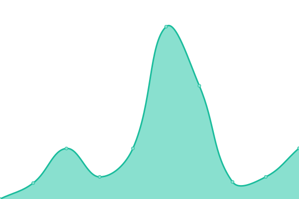

# [📈 Live Status](https://fareez2.github.io/jakim-up): <!--live status--> **🟧 Partial outage**

This repository contains the open-source uptime monitor and status page for [fareez2](https://fareez2.github.io/jakim-up), powered by [Upptime](https://github.com/upptime/upptime).

With [Upptime](https://upptime.js.org), you can get your own unlimited and free uptime monitor and status page, powered entirely by a GitHub repository. We use [Issues](https://github.com/fareez2/jakim-up/issues) as incident reports, [Actions](https://github.com/fareez2/jakim-up/actions) as uptime monitors, and [Pages](https://fareez2.github.io/jakim-up) for the status page.

<!--start: status pages-->
<!-- This summary is generated by Upptime (https://github.com/upptime/upptime) -->
<!-- Do not edit this manually, your changes will be overwritten -->
<!-- prettier-ignore -->
| URL | Status | History | Response Time | Uptime |
| --- | ------ | ------- | ------------- | ------ |
|  [Jakim MyDQ](https://mydq.islam.gov.my/) | 🟥 Down | [jakim-my-dq.yml](https://github.com/fareez2/jakim-up/commits/HEAD/history/jakim-my-dq.yml) | 

 2455ms
     
 | 

<a href="https://fareez2.github.io/jakim-up/history/jakim-my-dq">97.73%</a>
    

|  [E-solat](https://www.e-solat.gov.my/) | 🟩 Up | [e-solat.yml](https://github.com/fareez2/jakim-up/commits/HEAD/history/e-solat.yml) | 

 2050ms
     
 | 

<a href="https://fareez2.github.io/jakim-up/history/e-solat">100.00%</a>
    

<!--end: status pages-->

[**Visit our status website →**](https://fareez2.github.io/jakim-up)

## 📄 License

- Powered by: [Upptime](https://github.com/upptime/upptime)
- Code: [MIT](./LICENSE) © [Anand Chowdhary](https://anandchowdhary.com), supported by [Pabio](https://pabio.com)
- Data in the `./history` directory: [Open Database License](https://opendatacommons.org/licenses/odbl/1-0/)
